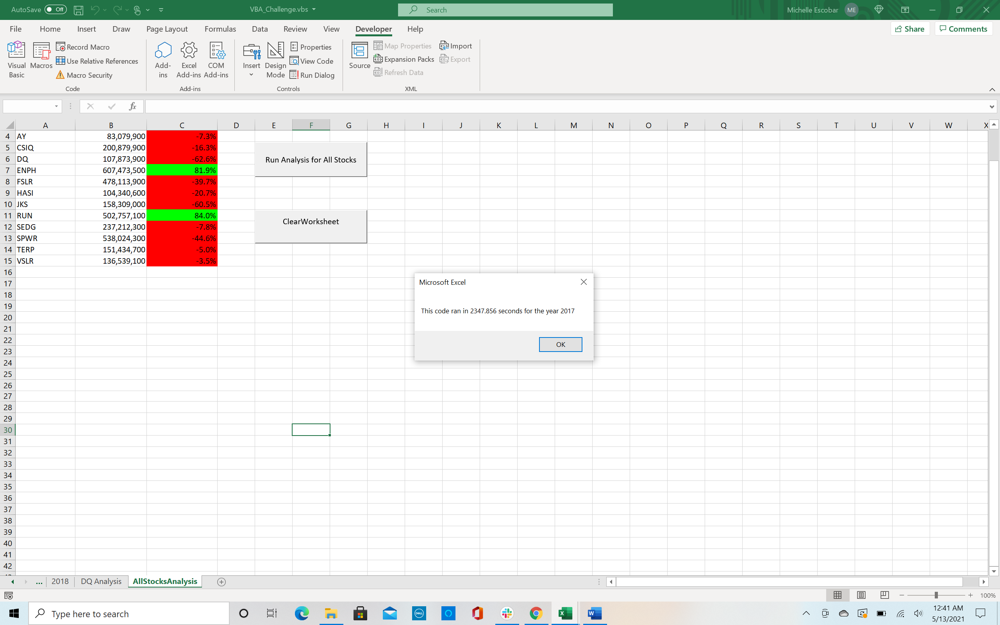

 
Refactoring Code for Green Energy Stocks

Purpose
As per your request here are the changes to the original data analysis given to you to determine which stock is best for your parents to invest in. You will find that the VBA code has been refactored to include the changes you have requested. I hope that you will find these changes help you compare multiple stocks more efficiently.

Results of Refactoring
You will find that the code now runs faster by running through all the data once to collect the information needed. The total daily volume, yearly starting prices as well as the ending prices have been included. This will show how successful the stocks were over that particular year. 
Below you will see the part of the code that was refactored. I have numbered them from one to four. A description is listed as well to explain what information was being factored.

Some advantages of the code 
Some of the advantages of refactoring the code is being able to make the quality of the code more efficient. One of the ways this was done is by performing needed tasks in a faster time frame. Also, we can make sure the code is more organized and easier for others to understand and follow along with the process taken to accomplish the desire goal. 

Disadvantages of the original and refactored VBA script
Disadvantages of refactoring code is it can be time consuming as well as confusing in determining how to go about it if you are not fully clear on the steps you should take to make the code more efficient. Also, if you are not in the habit of activating the sheet needed before formatting, in the future someone can go back later to refactor the code and it may not run as intended after the changes are made. 

